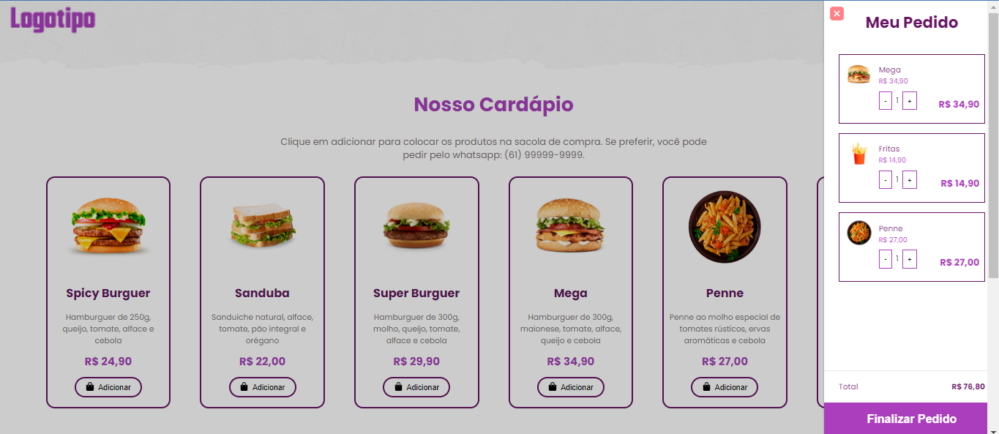

<p align="center">
    
</p>

<p align="center">
  Criando seus cardápios digitais de forma simples 
</p>

<br>
<h1>Sobre o Projeto</h1>
<p>Projeto desenvolvido na semana js no canal Dev. </p>

<br>

<h1>Instalação</h1>
<p>depois de fazer o download e extrair no local desejado execute o comando abaixo</p>

```
npm install 
```
<p>para executar segue abaixo o comando</p>

```
npm start 
```

<br>

<h1>Funcionalidades</h1>



<br>

<h1>Tecnologias</h1>
<p>Projeto desenvolvido com as seguintes Tecnologias</p>

<ul>
    <li>JavaScript</li>
    <li>Node.js</li>
    <li>SQLite</li>    
</ul>

<br>

<h1>Projeto finalizado</h1>
<p><a href="" target="_blank">Clique aqui para seguir para o projeto finalizado</a></p>

<h1>Licença</h1>
<p>Esse projeto está sob a licença MIT.</p>


<br>
<p align="center">Feito com ❤️ por Kelson Carvalho</p>
